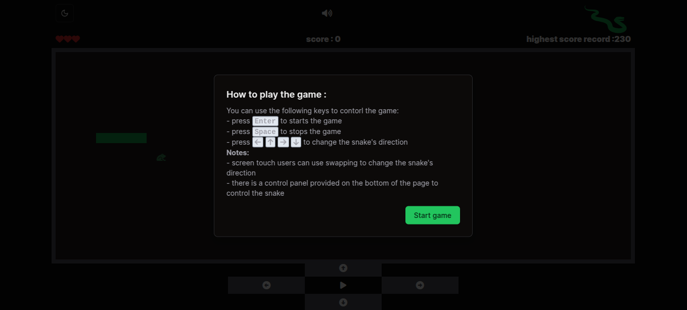
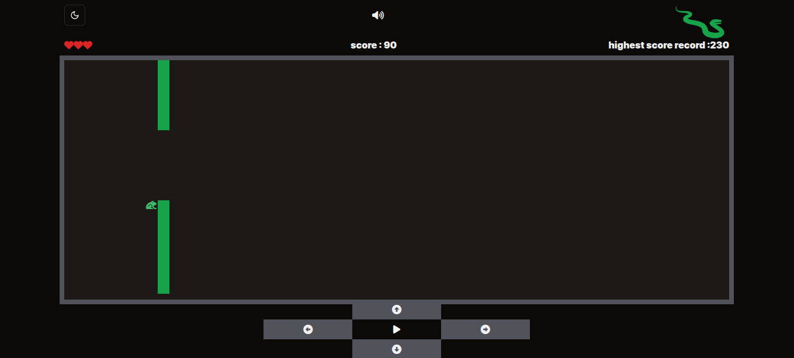
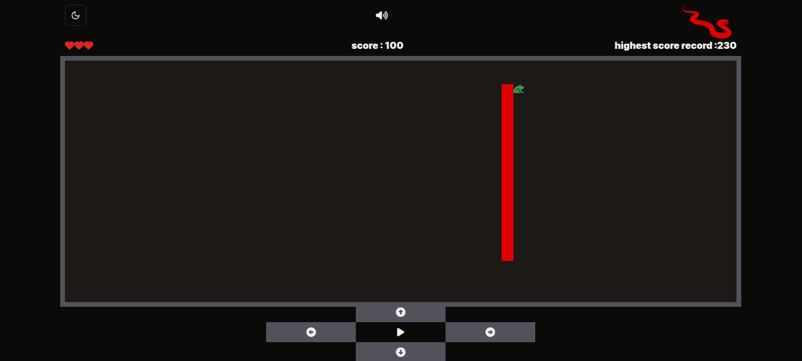
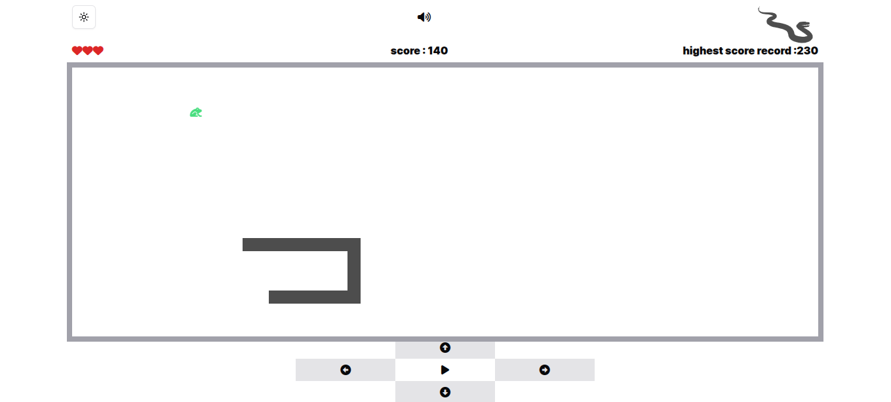

# 🐍 Snake Game

A classic Snake game built with **React**, **TypeScript**, **shadcnUI**, and **TailwindCSS**.

## 🚀 Features

- Built using **React** and **TypeScript**
- Styled with **TailwindCSS** for a modern look
- Some UI components provided by **shadcn/ui**
- Fully **responsive design** for optimal viewing on all devices

## 📸 Preview

<style>
  .screenshot-grid {
    display: grid;
    grid-template-columns: repeat(2, 1fr);
    gap: 10px;
  }
  @media (max-width: 480px) {
    .screenshot-grid {
      grid-template-columns: 1fr;
    }
  }
</style>

<div class="screenshot-grid">
  
  
  
  
</div>

## 🛠️ Installation & Running Locally

Clone the repository and install the dependencies:

```bash
git clone https://github.com/Amin-Zahed/snake-game.git
cd snake-game
npm install
npm run dev
```
